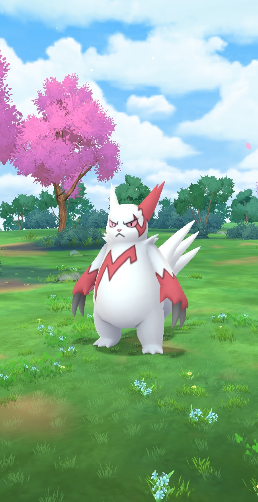

# BoxBlurAlgorithm

## Overview

**BoxBlurAlgorithm** is a Python implementation of the box blur algorithm, a simple and efficient technique used for 
image blurring. This repository provides an easy-to-use interface for applying the box blur effect to images, making it 
suitable for beginners and those interested in basic image processing. This implementation has also few quite useful 
features, like for example information about how long took the algorithm to blur image and custom blur intensity.

## Features

- Easily customizable blur intensity
- Time measurement: while the algorithm is working, there is an information how long does it take for every step to run. 
At the end of program, the `.json` file with more detailed information is created.
- Customisation based on `.env` file

## What is Box Blur?

Box blur is a type of image-blurring filter that uses a square box-shaped kernel. Each pixel in the output image is 
set to the average of its neighboring pixels in the input image. It's one of the simplest forms of blurring and is
often used as a building block for more complex filters.

## Example Images

| Original                         | Blurred (intensity = 10)       |
|----------------------------------|--------------------------------|
|    |  |

## Usage
1. Paste all images You want to blur into `input/` directory. There is no need for special filenames or any other preparation.
2. In `.env` file set the intensity value (recommended are values under 40, above this value there are many distortions).
3. Run the `main.py` script and wait for it to do the magic.
4. When the code is done, under the `output/` directory there are folders for every input file, inside every of them there are three files: 
   1. Input image, named `input` and the input file extension
   2. The result of code, named `output` and the input file extension
   3. All the blurring statistics, under the `data.json` file

## Contributing

Contributions are welcome! Please open issues or submit pull requests for improvements or bug fixes.

## Acknowledgments

- [Pillow](https://python-pillow.org/)

---

*Implementation of blurring algorithm in Python.*